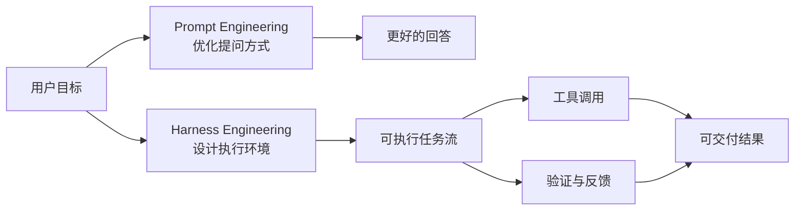
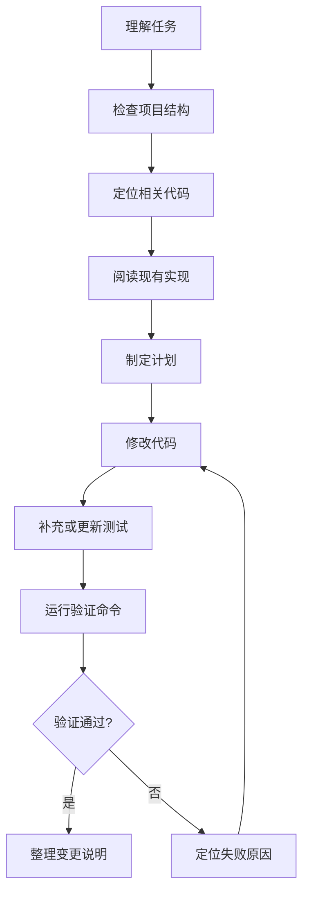
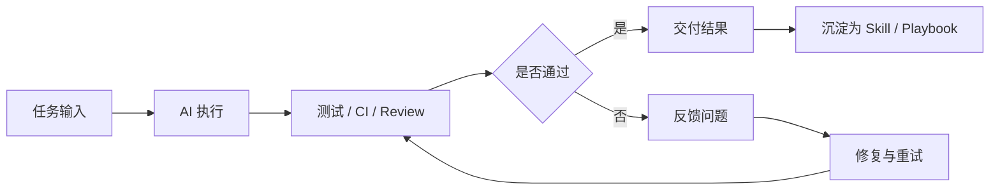
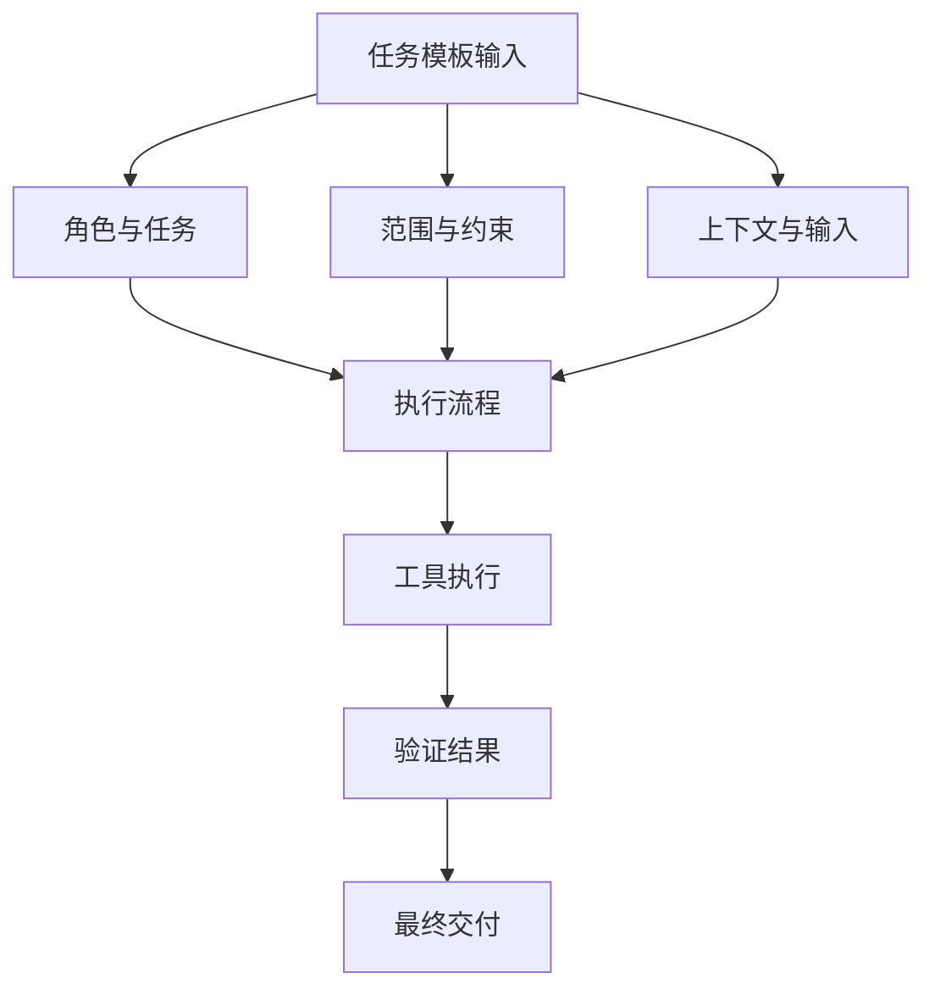
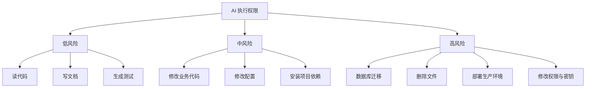
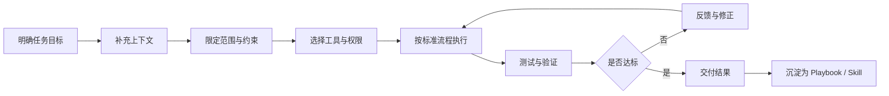

# Harness Engineering：把 AI 真正接进工程流程

## 1. 为什么要谈 Harness Engineering

这两年，团队里关于 AI 的讨论很多，但真正落到研发现场，问题往往很具体：

- 为什么 AI 有时看起来很能干，有时又完全不靠谱？
- 为什么它能写出一段像样的代码，却经常交不出一个可验证的结果？
- 为什么同一个任务，换个人问、换种说法，结果差异会这么大？

如果把 AI 只当成一个“更会说话的搜索框”，这些问题几乎无解。因为问题不只出在模型本身，更出在我们给它的工作环境太松散：任务定义不清、上下文不完整、工具边界不明确、验证机制缺失，最后只能得到一个“像完成了”的回答。

Harness Engineering 想解决的，正是这类问题。

它不是某种新奇技巧，也不只是把 prompt 写得更复杂。更准确地说，它是一套把 AI 纳入工程流程的方法：给任务加边界，给执行加路径，给结果加验证，给经验加沉淀。

一句话概括：

> Harness Engineering 关注的不是“AI 会不会回答”，而是“AI 能不能稳定交付”。

---

## 2. 什么是 Harness Engineering

可以把 Harness Engineering 理解成给 AI 搭一套“任务运行框架”。

在这套框架里，AI 不再只是被动响应问题，而是要在明确目标、范围、上下文、工具和验收标准的前提下完成任务。

它的关注点不是模型的单次表现，而是整个执行链路是否可控：

- 任务有没有被定义清楚
- 项目背景有没有被准确提供
- AI 能调用哪些工具，边界在哪里
- 执行是否遵循固定流程
- 结果有没有经过真实验证
- 成功经验能不能复用

所以，AI 是执行者，Harness 是执行环境。没有 Harness，AI 更像一次临场发挥；有了 Harness，AI 才有可能成为工程流程里稳定的一环。

---

## 3. 它和 Prompt Engineering 到底差在哪

Prompt Engineering 当然重要，但它解决的主要是“怎么问”。

Harness Engineering 解决的是另一层问题：

“当问题已经提出后，AI 应该在什么环境里、按什么方式、用什么工具、经过哪些检查，把事情做完。”

两者的区别可以放在一张表里看：

| 维度 | Prompt Engineering | Harness Engineering |
|---|---|---|
| 关注点 | 优化模型输入 | 设计 AI 的执行环境 |
| 核心目标 | 提高回答质量 | 提高任务交付稳定性 |
| 主要手段 | Prompt 模板、上下文组织 | 任务定义、工具、流程、验证、沉淀 |
| 输出 | 更好的文本结果 | 可执行且可验证的工程结果 |
| 失败后的处理 | 继续改 prompt | 复现、诊断、修复、重试 |
| 典型场景 | 问答、生成、摘要 | 编码、调试、评审、自动化 |

更简洁一点说：

- Prompt Engineering 解决“表达问题”。
- Harness Engineering 解决“交付问题”。



团队真正需要的，通常不是一个更会“说”的 AI，而是一个更会“做”的 AI。

---

## 4. 一个不带 Harness 的 AI，通常会怎么失手

这件事在工程里很常见。比如我们给 AI 一个任务：

“帮我实现登录功能。”

这句话看起来没问题，但实际缺了太多关键约束：

- 登录是账号密码、SSO，还是短信验证码？
- 允许改哪些目录？
- 需不需要兼容旧接口？
- 是否允许改数据库？
- 前后端分别在哪里？
- 验收标准是什么？
- 需要跑哪些测试？

于是 AI 往往会陷入一种典型状态：

- 能写代码，但不确定是不是该这么写
- 能输出方案，但没有依据现有项目结构
- 能给出结论，但没有真实验证
- 能说“完成了”，但没有留下可复查的证据

这并不是模型“笨”，而是任务环境没有工程化。Harness Engineering 的价值，就是把这些本来靠经验补齐的隐含条件，变成显式结构。

---

## 5. Harness Engineering 的核心组成

在实际工程里，Harness Engineering 可以拆成七个部分。它们合在一起，构成了 AI 的执行框架。

### 5.1 Task Harness：先把任务定义成可执行规格

AI 并不怕复杂任务，它更怕模糊任务。

相比“帮我实现登录功能”，下面这种写法明显更适合执行：

```markdown
目标：
- 实现用户登录功能

范围：
- 只修改 backend/auth 和 frontend/login 相关代码
- 不修改数据库 schema，除非需求明确提出

输入：
- 项目路径
- 登录接口文档
- UI 设计稿

输出：
- 可运行代码
- 测试用例
- 变更说明

约束：
- 复用现有 auth middleware
- 不引入新的状态管理库
- 保持向后兼容

验收标准：
- 单元测试通过
- e2e 登录流程通过
- 错误密码返回 401
- 登录成功后跳转 dashboard
```

好的任务定义，至少要回答六件事：

- 做什么
- 改哪里
- 参考什么
- 不能做什么
- 交付什么
- 怎么算完成

任务一旦被定义成“规格”，AI 的行为就更容易收敛，执行结果也更稳定。

### 5.2 Context Harness：别让 AI 靠猜理解项目

真实工程里，任务本身通常只占问题的一半，另一半是上下文。

如果没有上下文，AI 只能根据经验做“平均化推断”，这也是很多结果看上去合理、落到项目里却不合适的原因。

常见上下文包括：

- 项目目录结构
- 技术栈和关键依赖
- 模块边界
- 代码规范
- 测试命令
- 历史设计文档
- CI 日志和报错信息
- 业务约束和兼容性要求

项目里最好有一些稳定的上下文载体，比如：

- `AGENTS.md`
- `README.md`
- `docs/`
- 设计文档
- 测试脚本与 CI 配置

例如，一个简单但有效的 `AGENTS.md` 可以是这样：

```markdown
# Agent Instructions

## Tech Stack
- Backend: FastAPI
- Frontend: React + Vite
- Database: PostgreSQL
- Tests: pytest, playwright

## Rules
- Do not change public API without updating docs.
- Always run `uv run pytest` before finishing backend changes.
- Prefer small, focused commits.
- Do not add dependencies unless necessary.

## Useful Commands
- Backend tests: `uv run pytest`
- Frontend tests: `npm test`
- Type check: `npm run typecheck`
```

这类文件的意义并不在于“写文档”，而在于把原本只存在于资深开发者脑子里的默认规则，变成 AI 可以直接消费的工程上下文。

### 5.3 Tool Harness：工具要给，边界也要给

如果 AI 只能输出文本，它很难真正完成工程任务。它至少需要一些基本能力：

- 读写文件
- 搜索代码
- 修改代码
- 运行测试
- 查看日志
- 执行脚本
- 查看 diff
- 调用浏览器或接口

但工程里另一个常见误区是：只想着“让 AI 能做更多”，却忽略“让 AI 不能乱做”。

所以 Tool Harness 的关键不是工具数量，而是权限边界。比如：

```markdown
允许：
- 读取项目文件
- 修改 src/ 和 tests/
- 运行 pytest
- 运行 npm test
- 查看 git diff

禁止：
- 删除数据库
- 强制 push
- 修改 secrets
- 直接部署生产环境
- 未经确认安装系统级依赖
```

工具的本质是执行能力，边界的本质是风险控制。两者必须同时存在。

### 5.4 Execution Harness：让执行过程有固定路径

很多 AI 任务失败，并不是因为它不会写，而是因为它执行顺序错了。

功能开发任务通常至少应该经过下面这条路径：

1. 理解任务
2. 检查项目结构
3. 定位相关代码
4. 阅读现有实现
5. 制定计划
6. 修改代码
7. 添加或更新测试
8. 运行验证命令
9. 修复失败项
10. 总结变更和结果



不同任务可以有不同流程：

- Bug 修复强调先复现、再定位、再回归验证
- 重构强调先保护行为、再渐进修改、再持续回归
- 代码评审强调证据指向、风险分级和结论可复查

但无论是哪类任务，最怕的都是“想到哪做到哪”。Execution Harness 的意义，就是把执行方式从临场发挥变成标准路径。

### 5.5 Verification Harness：没有验证，就没有完成

这是整个方法里最关键的一环。

工程任务最大的误区之一，是把“生成了结果”和“完成了任务”混为一谈。对 AI 来说更是如此：它很容易写出一个看起来正确的答案，但这不等于结果真的可用。

一个合格的交付，应该附带真实验证记录，例如：

```markdown
已执行：
- `uv run pytest tests/auth`
- `npm run typecheck`
- `npm run test:e2e login.spec.ts`

结果：
- 42 tests passed
- typecheck passed
- login e2e passed
```

如果没有验证成功，也应该明确说明：

```markdown
未能完成验证：
- `npm test` 失败
- 原因：缺少 node_modules
- 已尝试安装依赖，但当前环境网络不可用
- 已完成代码修改，尚未完成运行验证
```

团队要建立一个共识：

> AI 的“我完成了”没有价值，测试、构建、类型检查和回归结果才有价值。

### 5.6 Memory / Skill Harness：把成功做法沉淀下来

如果某类任务反复出现，就不该每次从零开始组织输入。

例如这些高频场景：

- 修 API bug
- 做代码评审
- 写技术方案
- 修 CI
- 生成测试
- 排查线上问题
- 准备 PR 描述

对于这类任务，更合理的做法是把成功路径沉淀成可复用资产：

- Skill
- Playbook
- Checklist
- 模板
- 自动化脚本

例如，“修复后端接口 bug”可以固化成下面这样：

```markdown
# Playbook: 修复后端接口 bug

## 触发条件
- 用户要求修复 API bug
- 测试失败
- 接口返回异常

## 步骤
1. 读取错误日志
2. 找到对应 endpoint
3. 阅读测试与 schema
4. 复现问题
5. 添加回归测试
6. 修改实现
7. 运行相关测试
8. 输出根因、改动点和验证结果

## 禁忌
- 不要直接删除失败测试
- 不要通过修改测试绕开问题
- 不要在需求不明确时修改公共 API
```

当流程能沉淀下来，团队依赖的就不再是谁“更会提问”，而是谁把方法做成了标准资产。

### 5.7 Feedback Harness：把一次任务变成可迭代闭环

工程任务很少一次就完全正确。代码评审、CI、集成测试和人工验收，都会构成下一轮输入。

成熟的 AI 使用方式，应该是一个闭环：



这个闭环至少有两个价值：

- 让 AI 的输出持续被校正，而不是一次性拍板
- 让每次任务不只产出结果，也顺手改进下一次任务的执行方式

---

## 6. 在实际工程里，应该怎么用

如果要把 Harness Engineering 用到日常研发中，最有效的方式不是先讲概念，而是直接放进具体场景里。

### 6.1 场景一：功能开发

相比一句“帮我实现支付功能”，更好的写法是：

```markdown
任务：
实现 Stripe Checkout 支付流程。

范围：
- 后端新增 checkout session API
- 前端新增支付按钮
- 不处理订阅，只处理一次性付款

上下文：
- 后端位于 `backend/`
- 前端位于 `frontend/`
- 当前认证用户可从 `request.user` 获取
- Stripe secret 从环境变量 `STRIPE_SECRET_KEY` 读取

约束：
- 不要把 secret 写入代码
- 不要修改现有订单表结构
- 不要引入新的前端状态管理库

验收标准：
- 后端测试覆盖 checkout session 创建
- 前端测试覆盖按钮点击
- 类型检查通过
- 输出实际执行过的测试命令和结果

执行要求：
1. 先检查项目结构
2. 找到 payment/order 相关代码
3. 制定简短计划
4. 实现功能
5. 添加测试
6. 运行验证
7. 总结变更与结果
```

这种写法并不复杂，但它把原本隐含在提问者脑子里的关键信息全都显式化了。

### 6.2 场景二：Bug 修复

Bug 修复任务的关键不只是“改掉错误”，而是先形成一个可复现、可回归的闭环。

```markdown
任务：
修复登录接口在密码错误时返回 500 的问题。

已知现象：
- POST /api/login
- 输入错误密码
- 期望返回 401
- 实际返回 500

要求：
1. 先复现问题
2. 找到根因
3. 添加回归测试
4. 修复实现
5. 运行相关测试
6. 输出：
   - 根因
   - 修改文件
   - 测试结果
```

这里真正重要的是：AI 不是“猜测修法”，而是“围绕证据修复问题”。

### 6.3 场景三：代码评审

代码评审特别适合 Harness 化，因为它天然要求结构化输出。

```markdown
任务：
评审当前分支相对于 main 的代码变更。

重点关注：
- 安全问题
- 并发问题
- API 兼容性
- 测试覆盖
- 错误处理
- 是否引入不必要依赖

不要关注：
- 轻微格式问题
- 主观命名偏好

输出格式：
1. 总体结论
2. 高风险问题
3. 中风险问题
4. 低风险建议
5. 必须修改项
6. 可选优化项

要求：
- 每个问题都指出具体文件和原因
- 不确定的地方明确标注“不确定”
- 不要编造不存在的代码
```

这样一来，AI 的工作重点会落在“找证据、分风险、给结论”，而不是写一段模糊的评语。

### 6.4 场景四：技术方案与设计文档

方案写作类任务，最容易出现“字很多、信息很少”的问题。Harness 的作用，是强制它围绕评审逻辑组织内容。

```markdown
任务：
为订单系统重构写一份技术方案。

背景：
- 当前订单状态散落在多个服务中
- 经常出现状态不一致
- 需要统一订单状态机

方案需要包含：
- 当前问题
- 目标
- 非目标
- 方案选项
- 推荐方案
- 数据模型
- API 变化
- 迁移计划
- 风险
- 回滚方案
- 验收标准

文风：
- 技术评审文档风格
- 结论明确
- 避免空泛表达
```

方案类任务不是让 AI “写得多”，而是让它“写得可评审”。

---

## 7. 一个团队里最值得先做的模板

如果团队要开始落地 Harness Engineering，第一步不是追求复杂系统，而是先把高频任务的输入模板标准化。

下面这份模板就足够实用：

```markdown
# AI Engineering Task Harness

## Role
你是当前项目的工程代理。你的目标不是只给建议，而是完成可验证的工程结果。

## Task
描述要完成的任务。

## Background
补充背景、业务目标、已知问题、相关上下文。

## Scope
允许修改：
- 

不允许修改：
- 

## Inputs
- 项目路径：
- 相关文件：
- 相关文档：
- 错误日志：
- 设计稿 / API 文档：

## Constraints
- 
- 
- 

## Expected Output
- 代码变更
- 测试
- 文档
- PR 描述
- 验证结果

## Acceptance Criteria
- 
- 
- 

## Required Workflow
1. 检查项目结构和相关文件
2. 阅读现有实现
3. 制定简短计划
4. 小步修改
5. 添加或更新测试
6. 运行验证命令
7. 修复失败
8. 输出最终总结

## Verification
必须实际执行以下命令，并报告真实结果：

```bash
# example
npm test
npm run typecheck
uv run pytest
```

## Final Response Format
1. 完成了什么
2. 修改了哪些文件
3. 如何验证
4. 测试结果
5. 已知限制
6. 建议下一步
```



模板的价值不在于形式，而在于它帮团队建立了一种共同语言：什么叫任务说清楚，什么叫上下文给够，什么叫真正完成。

---

## 8. 团队落地时，建议按这个顺序推进

如果要在团队里真正用起来，建议不要一上来做“大而全”的平台化建设，而是按下面的顺序逐步推进。

### 第一步：在项目根目录放一份 `AGENTS.md`

先把最基础、最常用的项目信息稳定下来，例如：

- 项目概览
- 架构简介
- 编码规则
- 测试命令
- 常见工作流
- 禁止操作
- 评审清单

这一步解决的是“AI 每次进项目都像第一次来”的问题。

### 第二步：为高频任务建立 Playbook

优先整理三到五类最常见的任务，比如：

- `fix-bug.md`
- `implement-feature.md`
- `code-review.md`
- `write-design-doc.md`
- `debug-ci.md`

每个 Playbook 都尽量回答这些问题：

- 什么时候使用
- 需要哪些输入
- 按什么流程执行
- 如何验证
- 产出格式是什么
- 常见坑有哪些

这一步解决的是“同一类任务每次都重新组织一遍”的问题。

### 第三步：为改动类型定义验证矩阵

不同类型的改动，最低验证要求应该明确，而不是靠操作者自行判断。

| 改动类型 | 最低验证要求 |
|---|---|
| Backend 逻辑变更 | `uv run pytest`、静态检查 |
| Frontend 页面变更 | `npm test`、`npm run typecheck` |
| API 变更 | 接口测试、兼容性检查、文档同步 |
| DB migration | 迁移验证、回滚验证 |
| 配置变更 | 启动验证、关键路径 smoke test |

这一步解决的是“写完了”和“验证通过了”经常被混为一谈的问题。

### 第四步：按风险分层开放权限

并不是所有动作都应该自动化。团队最好提前约定哪些是低风险、哪些必须人工确认。



高风险操作最好保留人工确认，这不是保守，而是工程纪律。

### 第五步：把成功经验沉淀成组织资产

当某条流程已经被反复验证，就应该把它沉淀下来，而不是继续依赖“谁更会写 prompt”。

组织资产可以是：

- Skill
- Playbook
- 模板
- 自动化脚本
- CI 检查项

走到这一步，团队对 AI 的使用方式就不再是零散技巧，而开始具备工程能力。

---

## 9. 一个成熟的 AI 工程任务，应该长什么样

一个成熟的 AI 任务，不一定复杂，但通常具备这些特征：

- 目标清晰
- 范围明确
- 上下文充分
- 工具受控
- 流程固定
- 结果可验证
- 失败可诊断
- 方法可复用

如果这些条件基本齐备，AI 在团队里的角色就会发生变化：

它不再只是一个“问答助手”，而更像一个被纳入流程管理的执行单元。

下面这张图可以概括一个成熟任务的完整链路：



这个链路里真正重要的，不是每个环节都做得很重，而是环节本身不能缺。

---

## 10. 如果现在就开始，最小可行方案是什么

如果团队今天就想试，不需要先建设一整套平台。一个足够实用的最小版本，只需要先做五件事：

1. 在项目根目录写一份 `AGENTS.md`
2. 为“功能开发 / Bug 修复 / 代码评审”各准备一个模板
3. 明确每类改动必须执行的验证命令
4. 要求 AI 输出真实执行结果，而不是口头总结
5. 把重复验证过的流程沉淀为 Skill 或 Playbook

从实践角度看，Harness Engineering 真正落地，看的不是概念是否完整，而是下面这些事情有没有发生：

- 任务是否被说清楚
- 上下文是否被补齐
- 风险边界是否明确
- AI 是否真正执行
- 结果是否经过验证
- 成功经验是否得到复用

只要这几件事开始稳定发生，团队其实就已经走在 Harness Engineering 的路上了。

---

## 11. 结语

Harness Engineering 的价值，不在于提出了一个新名词，而在于它把 AI 的使用方式从“偶尔有帮助的生成工具”，推进成“可以纳入工程流程的执行能力”。

它要求我们不再只关注 AI 说得像不像，而是去看：

- 任务定义是否清楚
- 执行过程是否受控
- 输出结果是否可验证
- 成功方法是否能够沉淀

说到底，Harness Engineering 解决的是工程里的老问题：

- 怎么减少不确定性
- 怎么提高交付稳定性
- 怎么让经验可以复用

只是这一次，应用对象从人和流程，扩展到了 AI。

如果要用一句最短的话来总结它，我会这样说：

> Prompt 决定 AI 怎么理解问题，Harness 决定 AI 能不能把问题做完。

这也是为什么在真实工程里，Prompt Engineering 当然重要，但 Harness Engineering 更接近长期有效的方法。